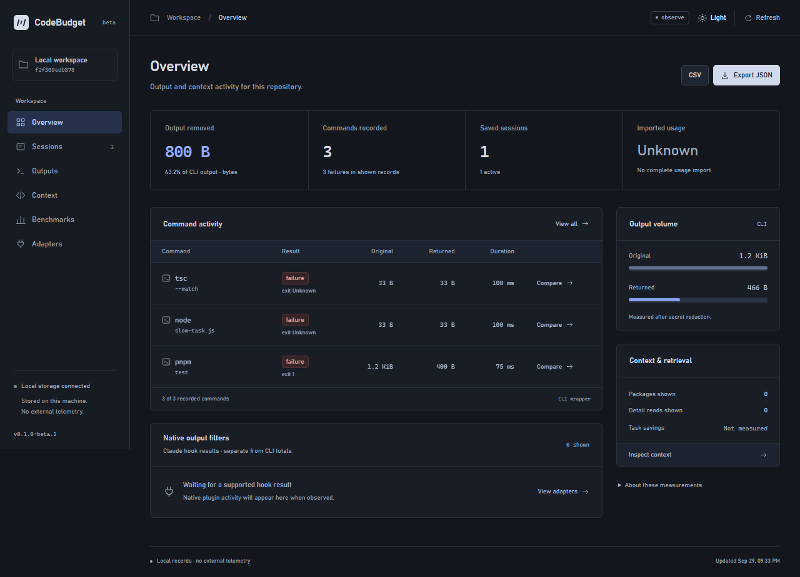
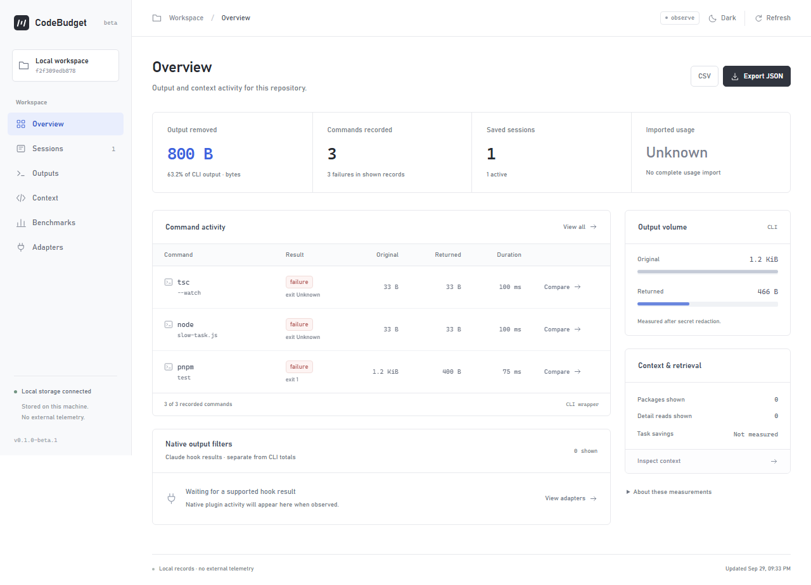

# CodeBudget

**Give coding agents the evidence they need, within a budget you control.**

CodeBudget is a local Claude Code plugin and CLI. It keeps noisy command output in a retrievable evidence archive, preserves useful diagnostics, and builds task-focused context from your actual source files. CodeBudget stores project configuration and evidence locally. No CodeBudget account or API key is required.

[](https://github.com/vahapogut/CodeBudget/actions/workflows/ci.yml)
[](LICENSE)
[](docs/STATUS.md)

[Quickstart](docs/QUICKSTART.md) · [Türkçe başlangıç](docs/QUICKSTART.tr.md) · [Claude plugin](plugins/claude-codebudget/README.md) · [Compatibility](docs/ADAPTERS.md) · [Roadmap](ROADMAP.md)



<details>
<summary>View the light theme</summary>



</details>

The dashboard reads your local SQLite database and remembers your light/dark preference. Screenshots show disposable browser-test records, not measured provider savings.

## What it does

| Workflow | What you get |
| --- | --- |
| Noisy commands | Bounded output, preserved diagnostics and an evidence reference for the original masked record. Nine reducer families cover tests, typechecks, lint, Git, search, JSON and repeated logs. |
| Source exploration | Real JS/TS/JSX/TSX source ranges, import relationships, selection reasons and explicit omissions within a serialized context budget. Other files use a labeled text-search fallback. |
| Long-running work | Repository-scoped sessions, checkpoints, change tracking and repeat-failure warnings. |
| Agent integration | A native Claude Code plugin and three MCP tools: `prepare_context`, `read_evidence`, `get_changes`. Project-local adapters for Codex, Cursor and Antigravity. |
| Measurement | Local reports, a browser dashboard, explicit usage-file imports and reproducible replay/task benchmark harnesses. Missing measurements remain unknown. |

The default mode is **observe**. Switch to **balanced** to enable validated reductions. Redaction is separate from optimization. Commands retain executable/argv boundaries and run once; CodeBudget does not rewrite shell commands or grant permissions.

## Get started

**Free to use, including inside a company.** Offering CodeBudget or a modified version as a commercial product, paid bundle or commercial hosted service requires prior written permission from **vahapogut**. There is no paid CodeBudget tier. These are custom source-available terms; previously published Apache-2.0 material retains its original rights. See the [license policy and examples](LICENSING.md).

Requires **Node.js 22.16+ on the 22 line, or Node.js 24**, and **pnpm 10.33.2**. Installation needs network access; core workflows use packaged local assets afterward.

```sh
git clone https://github.com/vahapogut/CodeBudget.git
cd CodeBudget
pnpm install --frozen-lockfile
pnpm build
```

Initialize the project you want to work on, then load the native plugin from that project:

```sh
node /absolute/path/to/CodeBudget/dist/cli.js --root /absolute/path/to/your-project init
cd /absolute/path/to/your-project
claude --plugin-dir /absolute/path/to/CodeBudget/plugins/claude-codebudget
```

Use quoted absolute paths when they contain spaces. Plugin loading is session-scoped: omit `--plugin-dir` to stop loading it. Avoid registering a second copy of its MCP server. Output replacement is enabled for Claude Code **2.1.216 and later 2.x releases**; hook-contract fixtures run on 2.1.216 and 2.1.285, and CI checks the installed plugin against the newest published client. Unrecognized output shapes keep the original result, and `codebudget doctor` reports why the hook stayed inactive. Real model-visible replacement is still an [acceptance gate](docs/VERIFICATION.md#adapter-boundary).

To use the CLI from this checkout:

```sh
node dist/cli.js init
node dist/cli.js doctor
node dist/cli.js run -- node -e "console.log('hello from CodeBudget')"
node dist/cli.js report --format json
node dist/cli.js dashboard
```

Open the dashboard URL printed by the CLI. The link works once: the page exchanges it for a session token, so a copied browser-history entry cannot reopen the dashboard. Keep the running process private. No daemon starts until you request one.

For a portable local installation, use `pnpm pack:release` and install the resulting archive from `dist/`. An npm registry release is not yet available; plain `pnpm pack` is not the release workflow.

## Everyday commands

These examples use the installed `codebudget` binary. You can also use `node /absolute/path/to/CodeBudget/dist/cli.js`.

```sh
# Enable reductions; init starts in observe mode.
codebudget config mode balanced

# Index saved source and build a task-specific package.
codebudget index
codebudget context --task "Fix refresh token rotation" --budget 8000

# Retrieve evidence when a preview is insufficient.
codebudget artifact read <id> --offset 0 --limit 200

# Keep work scoped to a session.
codebudget session start --task "Fix refresh token rotation"
codebudget session checkpoint --session <id>
codebudget report --session <id>
codebudget session close --session <id>

# Preview a project-local client integration.
codebudget adapters install codex --dry-run

# Run free local measurements and preview retention cleanup.
codebudget benchmark replay --corpus all
codebudget benchmark tasks --dry-run
codebudget data prune --dry-run
```

See `codebudget --help` and the [quickstart](docs/QUICKSTART.md) for options. Context packages report missing required content and a minimum budget when a complete selection cannot fit. Unsaved editor buffers and hidden client prompts are outside the local index.

## What the measurements mean

**Smaller output is measurable. Lower total model cost is a hypothesis until tested.** CodeBudget keeps these separate:

- **Bytes:** locally measured content and controlled envelopes.
- **Tokens:** local estimates or an explicitly selected local encoding; provider message overhead is separate.
- **Usage:** imported client-reported counters, with missing fields and cumulative counters identified.
- **Cost and quota:** unknown unless there is appropriate observed evidence. Output reduction does not establish subscription savings.

The [benchmark report](docs/BENCHMARKS.md) separates synthetic fixtures from captured tool output. The [verification record](docs/VERIFICATION.md) lists actual commands, platform results and remaining limits. The 30-task harness and its reference solutions are local test infrastructure; they are not completed model experiments.

## Privacy and compatibility

Evidence is masked before normal storage and is repository-scoped. Raw archival is a separate explicit opt-in that a committed `.codebudget.json` cannot enable: use the ignored `.codebudget/local.json` or `CODEBUDGET_RAW_ARCHIVE=1`. Storage stays within `diskBudgetBytes` by evicting the oldest evidence first. Redaction is imperfect; the existing coding client still controls what it sends to its provider. `run --raw` forwards original unmasked machine output while keeping the normal archive masked.

The dashboard has no analytics, remote fonts or hosted backend. It uses loopback authentication and renders evidence as text. Client integrations preserve normal permissions and do not alter global settings. MCP registration exposes tools; it does not intercept every built-in client operation. See [privacy](PRIVACY.md), [security](SECURITY.md) and the [client support matrix](docs/ADAPTERS.md).

## Develop and verify

```sh
pnpm verify          # lint, strict types, local tests, build, browser E2E
pnpm smoke:package   # install the release archive into a clean temporary project
pnpm smoke:clients   # optional: actual installed Codex MCP handshake; no model
```

The CI matrix runs Node 22 and 24 on Linux, macOS and Windows. Local gates do not invoke a model or publish a package. Results and qualifications are recorded in [verification](docs/VERIFICATION.md).

| Documentation | Purpose |
| --- | --- |
| [Architecture](docs/ARCHITECTURE.md) | Packages, data flow and boundaries |
| [Indexer and context](docs/INDEXER.md) | Source selection, budgets and tokenizer behavior |
| [Usage coverage](docs/USAGE_COVERAGE.md) | Missing counters, cumulative samples and attribution limits |
| [Client smoke](docs/CLIENT_SMOKE.md) | Actual Codex MCP discovery without a model session |
| [Benchmark methodology](docs/BENCHMARKS.md) | Replays, task evaluations and valid claims |
| [Troubleshooting](docs/TROUBLESHOOTING.md) | Common setup and runtime issues |
| [Contributing](CONTRIBUTING.md) | Local development and review expectations |
| [License policy](LICENSING.md) | Free use, commercial permission and prior Apache rights |
| [Execution plan](docs/EXECUTION_PLAN.md) | Requirement-by-requirement evidence |
| [Roadmap](ROADMAP.md) | Completed local work and remaining external gates |
| [Changelog](CHANGELOG.md) | Changes by version |

Created by [vahapogut](https://github.com/vahapogut). Current terms: [CodeBudget Free Use License 1.0](LICENSE). Commercial offerings require written permission. [Prior Apache-2.0 grants](LICENSING.md#prior-apache-20-releases-remain-usable) and dependencies' [original licenses](THIRD_PARTY_NOTICES.md) remain in effect.
