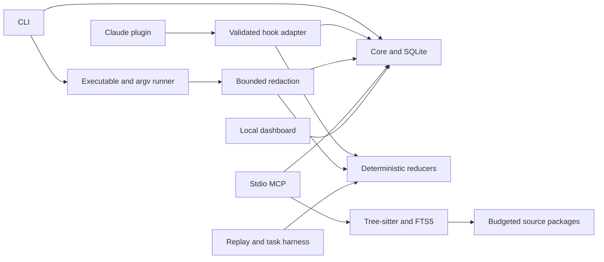

# Architecture

CodeBudget is a local TypeScript workspace with one distributable CLI and a native Claude Code plugin. The CLI runs on demand. MCP and the dashboard are opt-in long-running processes. No hosted account, background daemon, vector database or model call is required for the core.

## Boundaries

| Area | Responsibility |
| --- | --- |
| `apps/cli` | Parse commands, enforce explicit action boundaries, present local evidence. |
| `apps/dashboard` | Accessible local views backed by stored records. |
| `packages/core` | Versioned config, paths/redaction, SQLite, artifacts, sessions, usage and command runner. |
| `packages/reducers` | Format detection, parsing, deterministic transformation and separate evidence validation. |
| `packages/indexer` | Repository scanning, packaged grammars, symbols/imports, FTS5, source freshness, context selection. |
| `packages/mcp` | Three bounded tools, stdio transport and repository-scoped evidence references. |
| `packages/adapters` | Per-client capability matrix, reversible project settings, validated Claude hook events. |
| `packages/benchmarks` | Replay fixtures, thirty-task corpus, hidden evaluators and opt-in task runner contract. |

Core does not depend on a particular IDE. A client's documented capability, implementation and verification level are independent fields. `supported` never implies a real-client acceptance test passed.

## Data flow

A command is represented as an executable plus argv. The runner observes stdout/stderr chunks, decodes UTF-8 across boundaries, applies masking and writes bounded evidence in 16 KiB batches that keep the streams' interleaving. Piped stdin is forwarded unless disabled. Failure, cancellation, timeout (SIGTERM, then SIGKILL after two seconds), wrapper failure and output truncation remain distinct. An evidence-storage failure is recorded as `archiveError` and never stops the child; its exit code is still reported. It never executes a command twice to measure reduction. Repeat-failure detection compares a normalized error signature (timestamps, durations, addresses, process IDs and temporary paths removed) and a source fingerprint computed only after a failure; when the fingerprint cannot cover the tree it makes no repeat claim. The safe original archive is historical evidence, not a substitute for running tests again.

Reducers receive masked content. The original and reduced content-byte totals therefore share a security boundary. Reduction candidates must preserve protected evidence and offer a content gain. Observe mode reports candidate opportunities without replacing text. Machine consumers retain their required original/structured shape. Diff summaries are labeled as evidence rather than applicable patches. Envelope overhead and retrieval calls belong in task-level consumption accounting.

The indexer reads saved working-tree files with ignore rules, sensitive-path exclusions, symlink checks and size limits. Tree-sitter provides syntax structure for JS/TS/JSX/TSX, not a full type resolver or exact call graph. Other languages have labeled text fallback. Stable ranking combines task terms, source locations, names, dependencies and related tests. Context includes actual code, hashes, ranges, reasons, omissions and explicit completeness. Final serialized controlled envelopes are included in token estimates.

`prepare_context(task,budget,sessionId?)`, `read_evidence(id,offset?,limit?)` and `get_changes(since,sessionId?)` form the MCP surface. IDs resolve authorized source/artifact references; arbitrary filesystem paths and generic shell tools are not exposed. Protocol stdout is reserved for MCP messages and logs use stderr, including anything the evidence worker thread prints. Operations run one at a time in a queue of at most eight, can be cancelled while queued and time out after `mcpTimeoutMs`. Results stay below 480,000 bytes; large tools declare `_meta["anthropic/maxResultSizeChars"]` so Claude Code accepts them without its default 25,000-token cut. `read_evidence` pages carry a slim artifact header and at most 60 KiB of records. An oversized request line ends the server with an error instead of leaving the client waiting.

## Local state

Project configuration is `.codebudget.json`; local-only switches live in the ignored `.codebudget/local.json`. The default `.codebudget/` directory contains local SQLite state and artifacts, excluded from Git and carrying its own `*` ignore file. SQLite uses prepared statements, foreign keys, WAL with `synchronous=NORMAL` and a busy timeout: the database stays consistent after a crash and syncs at checkpoints rather than on every evidence batch, so a power loss can drop the most recent batches. The state schema is versioned (currently 3) and migrated in place; a newer schema is refused rather than rewritten. Evidence is stored in 16 KiB blocks that keep record boundaries, so reads page by record without loading an artifact. Writes run in explicit transactions whose rollback never masks the original error. When the state passes half of `diskBudgetBytes`, expired and then the oldest artifacts are evicted; on `SQLITE_FULL` the same reclaim runs once before the write is retried. Repository identity derives from the canonical root; worktrees with different roots are isolated. Artifact IDs are checked against repository and optional session scope, expiry and page limits.

Sessions store task purpose, acceptance criteria, constraints, findings, assumptions, changed files, evidence, questions and next step. Compaction/session events reset visibility assumptions when observable. Claude lifecycle events are handled for every client version; only output replacement is limited to Claude Code 2.1.216 and later 2.x releases, and each declined hook records its reason as a `hook-noop` event. Where lifecycle events are unavailable, the system cannot assume a model still sees prior context. Saved source hashes govern freshness; unsaved editor buffers are outside visibility.

Usage events retain provenance (`provider_reported`, `client_reported`, `locally_estimated`) and unknown fields. Stable correlation IDs deduplicate observations. Imported cumulative metric samples are not summed as independent requests. Cache and reasoning subfields retain provider-specific relationships. Bills and quotas remain unknown without validated information.

## Experimental boundary

Experimental model functions are off by default and independently flagged. A configured local endpoint or authorized API runner is a separate workflow, with limits, cancellation and evidence requirements. It does not change an IDE subscription's endpoint or account. See [experimental module](EXPERIMENTAL.md).

## Packaging and verification

The build bundles the CLI (code-split so `run` and `--version` do not load the indexer, tokenizers or MCP SDK), self-contained plugin entry points, local dashboard assets, Tree-sitter runtime and grammars. Small launchers check for Node.js 22.16+ first and silence only the SQLite experimental notice; the hook launcher leaves tool results unchanged on an older runtime. Package smoke tests install a generated archive into a temporary project and exercise its commands. Dependency acquisition can require the network; packaged core use does not. Cross-platform CI is not evidence that all platforms have already run successfully; the execution record belongs in [verification](VERIFICATION.md).
